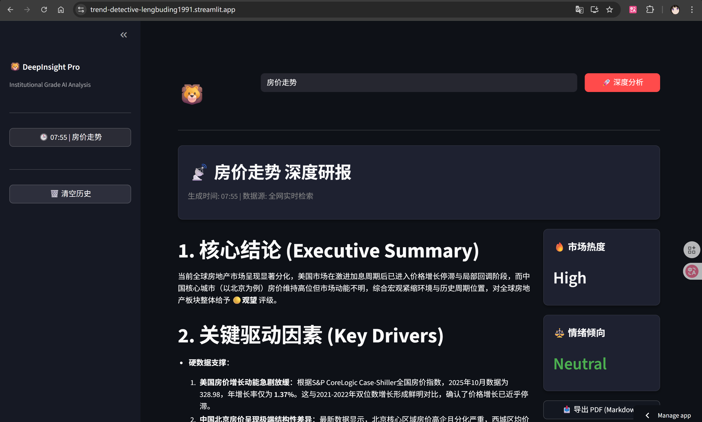

# 2026.1.28全网热点侦探

项目完成时间：2026年1月28日

项目网址：https://trend-detective-lengbuding1991.streamlit.app

核心功能： 输入关键词 -> 自动全网实时搜索 -> AI 深度分析 -> 生成决策简报

1. 做这个项目的原因：
* 原先要查询一个行业最新动态需要打开好多网址进行查询，同时还要辨别真假容易看漏
* 现在通过这个项目直接根据行业关键字进行查询，AI将活都干了，并且展示结论
1. 技术栈
* 大脑：DEEPSEEK负责分析和总结报告
* 眼睛：Tavily负责全网搜索实时最新数据（https://app.tavily.com/home）
* 流水线：工作流n8n负责把所有内容串起来
* 门面：Streamlit负责展示前端页面（Python 手搓的网页界面）（GitHub - lengbuding1991/trend-detective）
* 发布：trend负责将页面进行展示
1. 遇到的问题：
* 问题：AI展示的数据不是实时的，展示了2023年的数据，或者提示json格式问题
* 原因：传输数据的格式不对，因为有包含很多特殊字符，导致分析json文件内容出错
* 解决：利用最后用了一行代码 map(...).join('||').replace(/"/g, "'") 把数据“碾碎”成纯文本喂给 AI，瞬间治好了它的“幻觉”
1. 成果展示：

* 耗时：2小时
* 成本：一些token
1. 下一步计划：暂无
